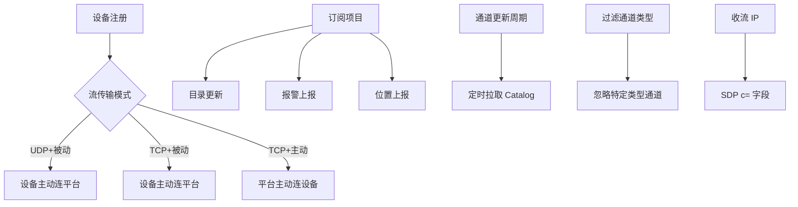

当然可以！你提供的截图是一个典型的 **GB/T 28181 平台“编辑设备”配置界面**，其中包含多个关键字段，用于控制设备通信方式、数据格式、订阅行为等。下面我将逐项为你详细解析这些字段的**中文含义、国标依据、实际作用及工程建议**。

---

## ✅ 一、左侧字段详解

### 1. `设备编号 *`（必填）
- **值示例**：`34020000001110000022`
- **含义**：设备唯一标识符（20位国标ID），第11~13位为类型码（如`111`=IPC）。
- **作用**：
  - SIP 注册时 From/To 地址
  - Catalog 查询目标
  - 点播 INVITE 的 DeviceID
- **注意**：必须全局唯一，不可重复。

---

### 2. `自定义名称`
- **值示例**：`chan name`
- **含义**：设备在平台中的显示名称（非国标字段，纯业务用途）
- **作用**：
  - UI 显示（如“前门摄像头”、“东区NVR”）
  - 搜索、分组、告警关联
- **建议**：支持中文、支持修改，不参与协议交互。

---

### 3. `信令联络 IP`
- **值示例**：`默认使用 livecms.ini > sip > host`
- **含义**：设备注册或接收信令时使用的 SIP 服务器地址（平台侧 IP）
- **作用**：
  - 设备向平台注册时的目标地址（Contact 中的 Host）
  - 若留空，平台自动填充本地监听 IP
- **工程建议**：
  - 多网卡环境需指定具体 IP
  - NAT 环境下可能需要填写公网 IP 或反代地址

---


### 5. `收流 IP`
- **值示例**：`默认使用 livesms.ini > sip > host`
- **含义**：平台接收 RTP 媒体流的 IP 地址（媒体服务器地址）
- **作用**：
  - 在 SDP 中作为 `c=` 字段发送给设备
  - 设备将 RTP 流发往该 IP + 端口
- **重要性**：
  - 内网设备需填写内网 IP
  - 公网设备需填写公网 IP 或 NAT 映射地址
  - 若平台部署在云上，需确保该 IP 可被设备访问

---

### 6. `过滤通道类型`
- **值示例**：`134 - 报警输入`, `135 - 报警输出`...
- **含义**：设备上报目录时，哪些类型的通道应被忽略（不显示/不处理）
- **作用**：
  - 减少无效通道干扰（如只关心视频，忽略音频/报警）
  - 节省存储和计算资源
- **工程建议**：
  - 支持多选（数组形式）
  - 过滤逻辑应在 Catalog 解析阶段执行

---

## ✅ 二、右侧字段详解

### 7. `通道更新周期(秒)`
- **值示例**：`3600`
- **含义**：平台主动拉取设备目录（Catalog）的间隔时间（单位：秒）
- **作用**：
  - 定期同步设备通道列表（防止设备未上报 NOTIFY）
  - 默认 3600 秒（1小时），可设为 0 表示禁用轮询
- **建议**：
  - 小型系统可设短（如 60 秒）
  - 大型系统建议配合 `SUBSCRIBE` 使用，避免频繁轮询

---

### 8. `字符集`
- **值示例**：`GB2312`
- **含义**：设备上报 XML 数据时使用的编码格式
- **作用**：
  - 解析 XML 时指定字符集，避免乱码
  - 常见值：`GB2312`（中国标准）、`UTF-8`（国际通用）
- **注意**：
  - 设备端应与平台一致
  - 若设备未声明编码，平台应尝试自动识别

---

### 9. `码流索引`
- **值示例**：`自动选择`
- **含义**：设备上报的码流索引号（主码流/子码流）
- **作用**：
  - 控制点播时请求哪个码流（如主码流=0，子码流=1）
  - 有些设备支持多路码流（如 H.264+H.265）
- **建议**：
  - 默认“自动选择” → 平台根据设备能力选择最优码流
  - 可手动指定（如强制使用子码流节省带宽）

---

### 10. `流传输模式`
- **选项**：`TCP` / `UDP` + `被动` / `主动`
- **含义**：
  - `TCP/UDP`：传输协议
  - `被动`：设备主动连接平台（适合内网）
  - `主动`：平台主动连接设备（适合公网设备）
- **组合说明**：

| 模式 | 适用场景 |
|------|----------|
| UDP + 被动 | 最常用，简单高效 |
| TCP + 被动 | 网络不稳定时保证可靠性 |
| TCP + 主动 | 设备在公网/固定 IP，平台主控 |

> ⚠️ 注意：`TCP 主动` 要求设备 IP 和端口对平台可达。

---

### 11. `订阅项目`
- **选项**：`目录` / `报警` / `位置` / `PTZ(2022)`
- **含义**：平台向设备订阅的事件类型
- **作用**：
  - 目录 → 接收设备通道变更通知
  - 报警 → 接收报警事件
  - 位置 → 接收移动设备位置上报
  - PTZ → 接收云台控制反馈（可选）
- **技术实现**：通过 SIP `SUBSCRIBE Event: Catalog/Alarm/...`

---

### 12. `设备录像`
- **选项**：`中心检索` / `模糊查询`
- **含义**：
  - `中心检索`：平台从设备获取录像文件列表（按时间/通道）
  - `模糊查询`：支持关键词搜索录像（如“前门 2025-01-01”）
- **作用**：
  - 实现录像回放功能
  - 依赖设备支持 `RECORD` 指令（GB28181-2016 附录 E）

---

### 13. `目录结构`
- **选项**：`行政区域优先`
- **含义**：设备目录展示顺序（按行政区划排序）
- **作用**：
  - UI 层按省市区层级展示设备
  - 便于运维管理
- **建议**：
  - 若设备 `CivilCode` 填写正确，则启用此选项
  - 否则按设备 ID 排序

---

## ✅ 三、总结：核心配置逻辑图



---

## ✅ 四、你的系统如何落地？

### 1. 数据库设计建议
```sql
CREATE TABLE device_config (
    id BIGINT PRIMARY KEY,
    device_id CHAR(20) NOT NULL,
    custom_name VARCHAR(64),
    sip_host VARCHAR(64),      -- 信令联络 IP
    media_host VARCHAR(64),     -- 收流 IP
    transport_mode ENUM('udp','tcp') DEFAULT 'udp',
    connect_type ENUM('passive','active') DEFAULT 'passive',
    subscribe_catalog BOOLEAN DEFAULT false,
    subscribe_alarm BOOLEAN DEFAULT false,
    update_interval INT DEFAULT 3600, -- 通道更新周期
    charset ENUM('gb2312','utf8') DEFAULT 'gb2312',
    stream_index VARCHAR(10) DEFAULT 'auto',
    filter_types JSON,          -- 过滤通道类型 [134,135...]
    INDEX idx_device (device_id)
);
```

### 2. PHP 配置类示例
```php
class DeviceConfig
{
    public $device_id;
    public $custom_name;
    public $sip_host;
    public $media_host;
    public $transport = 'udp';
    public $connect_type = 'passive';
    public $subscribe_catalog = false;
    public $subscribe_alarm = false;
    public $update_interval = 3600;
    public $charset = 'gb2312';
    public $stream_index = 'auto';
    public $filter_types = [];

    public function toSipSubscribe(): array {
        $events = [];
        if ($this->subscribe_catalog) $events[] = 'Catalog';
        if ($this->subscribe_alarm)   $events[] = 'Alarm';
        return $events;
    }
}
```


